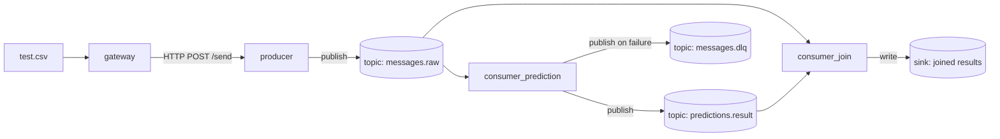

# Jailbreak Detection Pipeline — Architecture

## 1. Goal

Real-time pipeline that ingests chat prompts, classifies each as `benign` or
`jailbreak` using a transformer model, and joins each message with its
prediction for downstream consumption.

## 2. Components

| Service              | Responsibility                                                                 |
|-----------------------|--------------------------------------------------------------------------------|
| `gateway`             | Replays a CSV of prompts into the system via HTTP, one message at a time       |
| `producer`            | HTTP → Pulsar boundary. Validates input, stamps metadata, publishes raw message |
| `consumer_prediction` | Beam pipeline: consumes raw messages, runs ALBERT inference, publishes result   |
| `consumer_join`       | Beam pipeline: joins raw message + prediction by id, writes to a sink           |
| `pulsar`              | Message broker (topics below)                                                  |


## 3. Data flow



## 4. Message contracts

Every message carries a `schema_version` so consumers can evolve
independently of producers.

**`messages.raw`** (produced by `producer`)
```json
{
  "schema_version": 1,
  "id": "uuid",
  "message": "string",
  "produced_at": "ISO-8601 timestamp"
}
```

**`predictions.result`** (produced by `consumer_prediction`)
```json
{
  "schema_version": 1,
  "id": "uuid",
  "classification": "benign | jailbreak",
  "confidence": 0.0,
  "model_version": "string",
  "predicted_at": "ISO-8601 timestamp"
}
```

**`messages.dlq`** (produced by `producer` or `consumer_prediction` on failure)
```json
{
  "schema_version": 1,
  "original_payload": "string",
  "error": "string",
  "failed_at": "ISO-8601 timestamp",
  "stage": "producer | consumer_prediction"
}
```

**Joined result** (written by `consumer_join`)
```json
{
  "id": "uuid",
  "message": "string",
  "classification": "benign | jailbreak",
  "confidence": 0.0,
  "model_version": "string"
}
```

## 5. Non-functional decisions

Explicitly scoping what this build does and doesn't handle, and why.
| Concern              | Decision for this build                                                        | Rationale |
|-----------------------|----------------------------------------------------------------------------------|-----------|
| Broker HA             | Single standalone Pulsar node                                                    | Local/single-machine learning project; multi-broker cluster is a config change, not a redesign — documented as future work, not built |
| Delivery guarantees   | At-least-once (ack after successful processing, not before)                      | Simplest correct guarantee; exactly-once needs transactional outbox or Pulsar transactions, out of scope for v1 |
| Failed messages       | Dead-letter topic (`messages.dlq`) instead of silent drop                        | Original prototype silently dropped malformed messages; this is the cheapest fix with real payoff |
| Schema evolution      | `schema_version` field on every message                                          | Lets us change payload shape later without breaking running consumers |
| AuthN/AuthZ           | Out of scope for v1 — gateway/producer HTTP endpoints open on the docker network  | No external exposure in this build; flagged as the first thing to add before any real deployment |
| Observability         | Structured JSON logging (not print), each service logs `id` on every stage       | Cheap correlation across services without adding a tracing stack yet |
| Model rollout         | Keep hot-reload-by-mtime from the original prototype                             | Cheap and it worked; revisit with a real model registry only if this becomes a multi-model system |
| Scaling               | Single instance per service via docker-compose                                   | Beam/Pulsar both support scaling out later (more Pulsar consumers, Beam runner change); not needed at this size |
| Sink for joined result| Write to a file/simple store instead of just `print`                             | Original prototype's join stage was a dead end — this makes the output actually usable |

## 6. Build order

1. `pulsar` — broker up via docker-compose, topics created
2. `producer` — HTTP endpoint, publish to `messages.raw`, unit-testable without Pulsar (mock producer)
3. `consumer_prediction` — model loading + inference first (testable standalone), then wire to Pulsar
4. `consumer_join` — join logic, then sink
5. `gateway` — CSV replay driving the whole pipeline end-to-end
6. Wire all into `docker-compose.yaml`, smoke-test end-to-end with `test.csv`

Each step ships independently runnable/testable before moving to the next.
